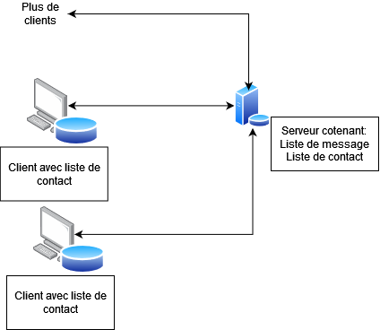

# Mini Serveur pour Courriel

>(INF4533) Technologies Internet : Projet 2
- [Mini Serveur pour Courriel](#mini-serveur-pour-courriel)
  - [Spécification fonctionnelle](#spécification-fonctionnelle)
    - [Fonctions du système](#fonctions-du-système)
    - [Présentation des fonctions implémentées](#présentation-des-fonctions-implémentées)
  - [Architecture du système](#architecture-du-système)
    - [Architecture du fichier index.js](#architecture-du-fichier-indexjs)
    - [Architecture du fichier client.js](#architecture-du-fichier-clientjs)
    - [Architecture du fichier index.html](#architecture-du-fichier-indexhtml)
  - [Fonctionnement du projet](#fonctionnement-du-projet)
  - [Installation](#installation)
    - [Adresse IP du routeur](#adresse-ip-du-routeur)
    - [Clé publique](#clé-publique)
  - [Utilisation du projet](#utilisation-du-projet)
    - [Les contacts](#les-contacts)
    - [Les messages](#les-messages)
  - [Tech Stack](#tech-stack)
  - [Auteurs](#auteurs)


## Spécification fonctionnelle
Cette section liste les services que notre projet est capable de livrer.
### Fonctions du système
Dans la liste à point ci-dessous sont énumérées les différentes fonctionnalités implémentées dans le système. Les fonctionnalités ne sont pas dans un ordre précis. 

1. Envoyer des messages à des contacts en choisissant à quel contact l’envoyer et en entrant manuellement dans une zone de texte le message à envoyer.
2. Pouvoir accéder à tous les messages reçus par l'utilisateur.
3. Créer de nouveau contacts en spécifiant son nom et sa clé publique.
4. Pouvoir modifier le nom et la clé publique d’un contact après avoir créé celui-ci
5. Pouvoir chercher à travers la banque de contacts enregistrés avec une recherche basé sur du texte (par exemple, si dans la recherche « ma » est entré, les contacts comme Marco et Emma devraient sortir).
6. Le client web doit être une Single Page Application.
7. Le mini-serveur doit pouvoir recevoir des messages en se synchronisant avec un pairs, une instance du même serveur sur une autre machine.
8. Les messages doivent être cryptés de manière asymétrique grâce aux clés publiques et privées des utilisateurs.

### Présentation des fonctions implémentées

| Fonctions : | Description : |
| --- | --- |
|getKeyPair() | Cette fonction permet de générer la clé publique ainsi que la clé privée et d’enregistrer cette dernière dans le localStorage. 
|decryptMsg(msg) | Cette fonction permet de déchiffrer le message en entrée si la clé privée de l’utilisateur est valide .
|refreshMsg(searchCond) | Cette fonction permet d'obtenir les messages du serveur avec la requête getLetters et les affiches sur la page.
|postEncryptedMsg(data) | Fonction qui fait le POST sur le serveur.
|<td colspan=2>**Les autres fonctions sont identiques à celles incluent dans Projet 1 à l’exception près**


## Architecture du système


### Architecture du fichier index.js

Ce fichier à comme tâche principale de créer et gérer le serveur du système. Il est constitué d’un bloc de code désigné à créer le serveur puis d’une série de requêtes GET  ou POST qui sont énumérés ci-dessous:

**Requête GET  :**

<ins>*/getLetters*</ins> :  Renvoie la liste des messages cryptés à partir du document letters.json.
/peers : Renvoie la liste de contacts (noms et clé publique) contenue dans le code du serveur.

<ins>*/*</ins> : affiche le document html correspondant à l’adresse “/public/index.html”.

**Requête POST :** 

<ins>*/addLetters*</ins> : ajoute un message crypté au document letters.json avec la clé du destinataire.

### Architecture du fichier client.js
Ce fichier contient toutes les fonctions pour gérer la page clients en plus de plusieurs fonctions pour permettre de communiquer et interagir avec le serveur. Une des tâches principales de ce fichier est de gérer tout ce qui a attrait aux contacts. Ce fichier contient toutes les fonctions pour ajouter, supprimer et modifier un contact en plus d’afficher tous les contacts. Ce fichier gère aussi tout ce qui est lié aux messages en permettant d’envoyer des messages et d’afficher les messages reçus. De plus, ce fichier permet d’encrypter les messages envoyés et de décrypter les messages reçus. Finalement, permet de faire une recherche dans respectivement la banque de messages reçus et dans la banque de contacts.

### Architecture du fichier index.html
Ce fichier gère tout l’aspect visuel du système. C’est via ce fichier qu’on peut afficher visuellement les tableaux des messages et des contacts, qu’on peut avoir des boutons qu’il possible de cliquer, que l’on peut se déplacer entre les sections "Accueil", ”Carnet d’adresse” et ”Messages” et que l’on peut avoir des zones d’entrée de texte.

## Fonctionnement du projet

## Installation
Pour tester l'ensemble des fonctionnalités de ce projet, 
il est favorable d'utiliser un deuxième ordinateur afin de pouvoir simuler le partage de messages entre deux ou plusieurs utilisateurs. 

Dans le contexte de notre exemple, le premier utilisateur (ordinateur A) qui sera l'hôte de notre mini serveur servira de destinataire aux messages envoyés, tandis que l'autre utilisateur (ordinateur B) servira d'expéditeur.


Pour lancer le projet, veuillez entrer dans le terminal :

```bash
  npm install
```
Afin d'activer le serveur :

```bash
  node index.js
```
Vous serez alors connecté sur le **port 3000** que vous pourrez accéder (http://localhost:3000/).
Vous devez maintenant fournir deux informations essentielles à l'expéditeur: **L'adresse IP de votre routeur** et votre **clé publique**
  
### Adresse IP du routeur  

D'abord, l'expéditeur doit se connecter au micrologiciel de votre routeur par l'entremise d'un quelconque navigateur. Pour trouver l'adresse IP de votre routeur, tapez *cmd* dans la barre de recherche Windows ou tapez *Terminal* dans Finder pour Mac
et appuyez sur Enter pour ouvrir l'invite de commande. Tapez ensuite :
```bash
  ipconfig
```
Faites défiler les informations jusqu'à ce que vous voyez un paramètre pour le **IPv4 Address** sous *Ethernet adapter* ou *Wireless LAN adapter*.
C'est votre routeur, et le numéro y étant associé est l'adresse IP de votre routeur.


### Clé publique  

Ensuite, vous verrez s'afficher notre page web dans votre navigateur. Notre modeste interface se divise en 3 onglets. De gauche à droite se situe respectivement l'onglet **Accueil** étant affiché par défaut lors du démarrage, suivi de **Carnet d'adresses** et **Messages**. 
Vous aurez également devant vous votre **clé publique** que vous devrez partager à l'expéditeur.

Si l'on présume que l'expéditeur ait en sa possession l'adresse IP de votre routeur ainsi que votre clé publique, il devra inscrire dans la barre d'adresse de son navigateur l'adresse IP de votre routeur suivi du numéro de port (3000) dans le format suivant :

```bash
  192.135.0.157:3000
```

L'expéditeur devrait voir s'afficher à l'écran notre site web. Il devra aller sous l'onglet **Carnet d'adresse** afin de créer son premier récipient et y associer la clé publique du destinataire.

Après avoir crée un contact, l'expéditeur devra se diriger vers l'onglet **Message** où il pourra envoyer du texte. Ceux-ci étant transmis au destinataire, seront affichés dans son navigateur, plus bas dans le même onglet sous la section Liste de Messages.

## Utilisation du projet
### Les contacts
Comme mentionné plus haut, pour entrer un nouveau contact en tant qu’expéditeur, il faut entrer son nom dans le champ de texte *Nom*, il faut entrer sa clé publique dans le champ de texte *Clé* puis il faut appuyer sur le bouton *Sauvegarder*. 
Pour modifier un contact, il faut appuyer sur le bouton *Modifier* dans la même rangé que le contact que vous souhaitez modifier. Ensuite, vous devez modifier le contenu dans les deux mêmes champs de texte que pour créer un contact en terminant encore par appuyer sur le bouton *Sauvegarder* une fois que vous avez fait les changements que vous désiriez faire. 
Si vous voulez supprimer un contact, appuyez simplement sur le bouton *Supprimer* dans la même rangé que le contact que vous souhaitez supprimer.
Vous pouvez chercher dans votre banque de contacts en entrant un mot clé dans le champ de texte *Filtre* puis en appuyant sur le bouton *Filtrer*.

### Les messages
Pour envoyer un message à un contact, vous devez d’abord choisir à quel contact vous voulez envoyer le message en choisissant dans la bande défilante *Destinataire*, puis vous devez écrire le message que vous désirez envoyer dans le champ de texte *Message* et vous devez appuyer sur le bouton *Envoyer* pour envoyer le message.
Vous pouvez chercher dans votre banque de message en entrant un mot clé dans le champ de texte Filtre puis en appuyant sur le bouton *Filtrer*.


## Tech Stack  

**Serveur:** Node

**Frameworks:** Express

**Librairies:** node-forge, body-parser


## Auteurs  

- [@Jean-Pierre Masri-Clermont](https://www.github.com/JPP44)
- [@Samuel Hein](https://www.github.com/SamHein8)
- [@Patrick Patenaude](https://www.github.com/Kamaiko)
- [@Lawrence Kater](https://www.github.com/lelwrence)
- [@Marco Klayton Djouwne](https://www.github.com/)
- [@Abdel-Gany Jr Odelele](https://www.github.com/2longAGO)


